# GitHub Zread Button - Design Specification

**Version:** 1.0.0
**Date:** 2025-11-09
**Status:** Ready for Implementation

---

## Table of Contents

1. [Architecture Overview](#1-architecture-overview)
2. [System Architecture](#2-system-architecture)
3. [Component Design](#3-component-design)
4. [Data Flow](#4-data-flow)
5. [Module Interfaces](#5-module-interfaces)
6. [State Management](#6-state-management)
7. [Extension Lifecycle](#7-extension-lifecycle)
8. [DOM Integration Strategy](#8-dom-integration-strategy)
9. [Error Handling Architecture](#9-error-handling-architecture)
10. [Performance Design](#10-performance-design)

---

## 1. Architecture Overview

### 1.1 High-Level Architecture

The GitHub Zread Button extension follows a **content script-based architecture** optimized for browser extensions. It operates entirely client-side with no backend dependencies.

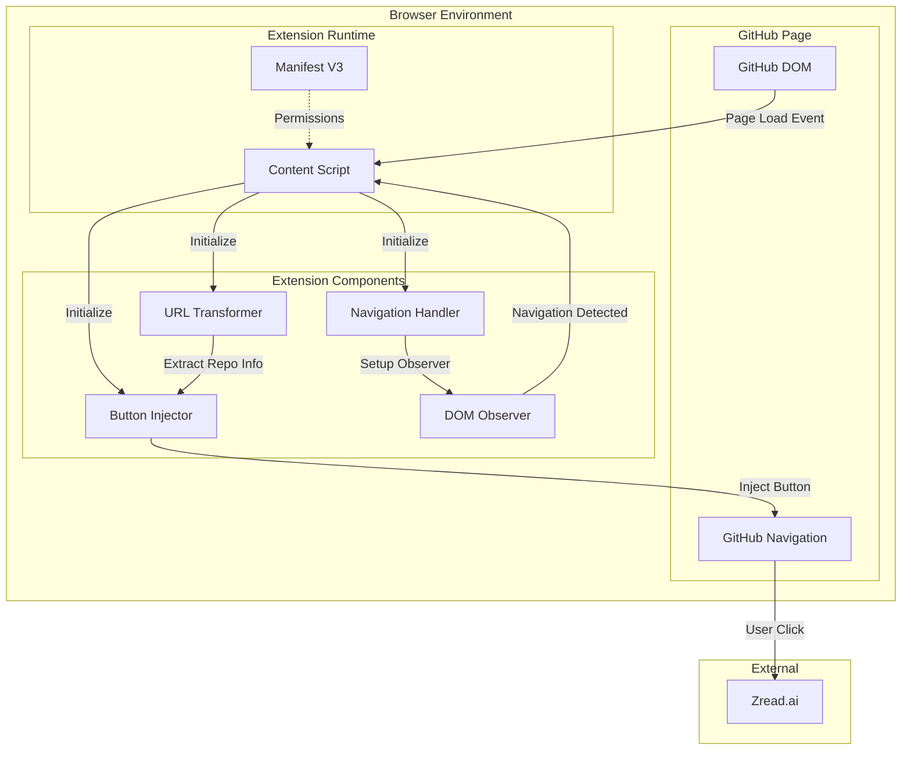

### 1.2 Design Principles

1. **Minimal Footprint**: Lightweight, fast-loading content script
2. **Zero Backend**: All processing happens client-side
3. **Privacy First**: No data collection or external API calls
4. **DOM Non-Invasive**: Integrates seamlessly without disrupting GitHub
5. **Resilient**: Handles GitHub UI changes gracefully
6. **Performance**: <100ms total impact on page load

---

## 2. System Architecture

### 2.1 Component Architecture

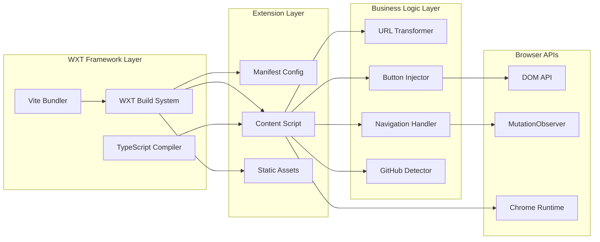

### 2.2 Directory Structure Design

```
github-zread-button/
├── entrypoints/
│   └── content.ts              # Main entry point
├── utils/
│   ├── url-transformer.ts      # URL transformation logic
│   ├── button-injector.ts      # DOM injection logic
│   ├── navigation-handler.ts   # SPA navigation handling
│   └── github-detector.ts      # Page detection utilities
├── assets/
│   └── styles/
│       └── content.css         # Button styling
├── public/
│   ├── icon/                   # Extension icons
│   └── _locales/               # i18n messages
├── wxt.config.ts               # WXT configuration
└── tsconfig.json               # TypeScript config
```

---

## 3. Component Design

### 3.1 Content Script (Main Orchestrator)

**File:** `entrypoints/content.ts`

```mermaid
stateDiagram-v2
    [*] --> Initialize
    Initialize --> CheckPage: Page Load
    CheckPage --> IsRepoPage{Is Repo Page?}
    IsRepoPage --> ExtractRepo: Yes
    IsRepoPage --> WaitNavigation: No

    ExtractRepo --> CheckButton{Button Exists?}
    CheckButton --> WaitNavigation: Yes
    CheckButton --> InjectButton: No

    InjectButton --> WaitNavigation
    WaitNavigation --> NavigationDetected: URL Change
    NavigationDetected --> CheckPage
```

**Responsibilities:**
- Initialize extension on GitHub pages
- Coordinate between utility modules
- Handle page lifecycle events
- Setup navigation observers

**Key Methods:**
```typescript
main(): void                    // Entry point
injectButtonIfNeeded(): void    // Conditional injection
handleNavigation(): void        // Navigation event handler
```

### 3.2 URL Transformer Module

**File:** `utils/url-transformer.ts`

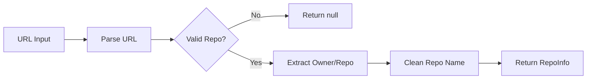

**Interface:**
```typescript
interface RepoInfo {
  owner: string;
  repo: string;
}

// Extract repository information from URL
extractRepoInfo(url: string): RepoInfo | null;

// Generate Zread.ai URL
generateZreadUrl(owner: string, repo: string): string;

// Check if current page is a repository page
isRepositoryPage(pathname: string): boolean;
```

**URL Pattern Matching:**
- Pattern: `/^\/([^/]+)\/([^/]+)/`
- Input: `https://github.com/facebook/react/issues`
- Output: `{ owner: "facebook", repo: "react" }`

### 3.3 Button Injector Module

**File:** `utils/button-injector.ts`

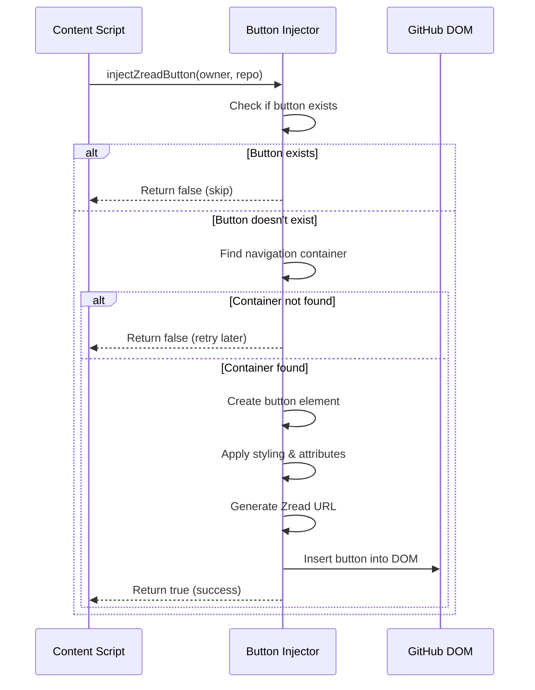

**Interface:**
```typescript
// Inject Zread button into GitHub navigation
injectZreadButton(owner: string, repo: string): boolean;

// Check if Zread button already exists
zreadButtonExists(): boolean;

// Remove existing Zread button
removeZreadButton(): void;

// Create button element
createButtonElement(owner: string, repo: string): HTMLElement;
```

**Button Structure:**
```html
<li class="zread-container">
  <a href="https://zread.ai/{owner}/{repo}"
     target="_blank"
     rel="noopener noreferrer"
     class="btn-sm btn BtnGroup-item zread-button">
    <span class="octicon">
      
    </span>
    Zread
  </a>
</li>
```

### 3.4 Navigation Handler Module

**File:** `utils/navigation-handler.ts`

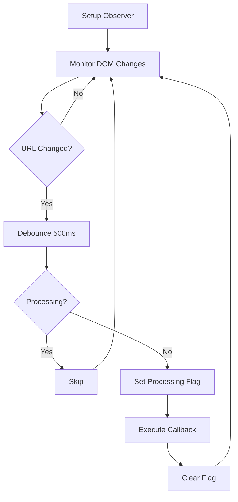

**Interface:**
```typescript
// Setup mutation observer for GitHub SPA navigation
setupNavigationObserver(callback: () => void): MutationObserver;

// Setup URL change detection
setupUrlChangeDetection(callback: (newUrl: string) => void): void;

// Cleanup observers
cleanupObservers(): void;
```

**Observer Configuration:**
```typescript
{
  subtree: true,
  childList: true,
  attributes: false
}
```

**Debouncing Strategy:**
- Delay: 500ms
- Flag: `isProcessing` to prevent concurrent executions
- Target: `document.body` for broad coverage

### 3.5 GitHub Detector Module

**File:** `utils/github-detector.ts`

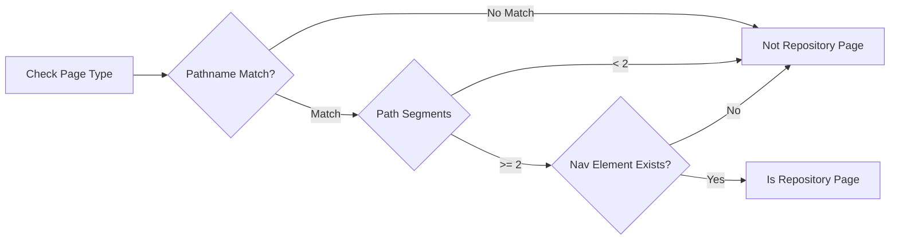

**Interface:**
```typescript
// Detect if current page is a repository page
isRepoPage(): boolean;

// Find GitHub navigation container
findNavigationContainer(): HTMLElement | null;

// Check if GitHub page is fully loaded
isPageReady(): boolean;
```

**Detection Criteria:**
- URL pattern: `/^\/[^/]+\/[^/]+/`
- Navigation element: `ul.pagehead-actions`
- Minimum path segments: 2

---

## 4. Data Flow

### 4.1 Initial Button Injection Flow

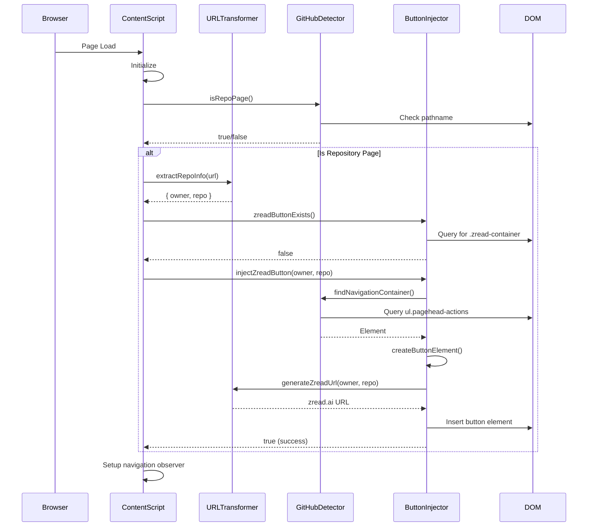

### 4.2 SPA Navigation Flow

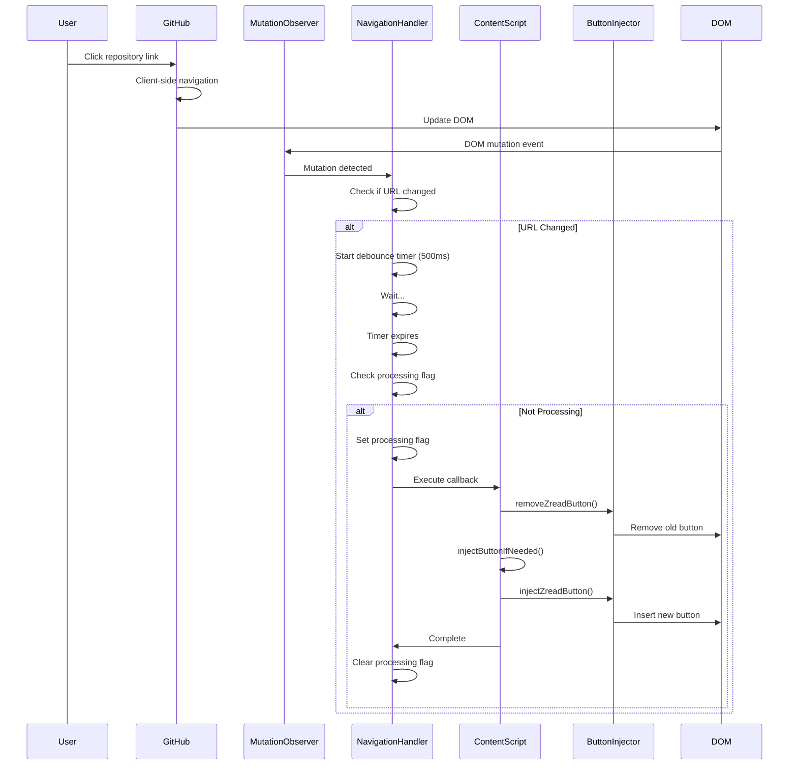

### 4.3 User Interaction Flow

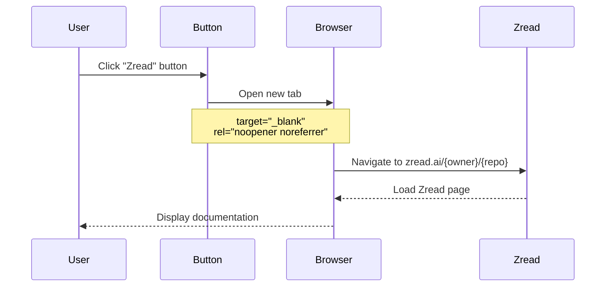

---

## 5. Module Interfaces

### 5.1 URL Transformer Interface

```typescript
/**
 * Repository information extracted from URL
 */
export interface RepoInfo {
  owner: string;
  repo: string;
}

/**
 * URL Transformer Module
 * Handles all URL-related transformations and validations
 */
export interface IUrlTransformer {
  /**
   * Extract repository owner and name from GitHub URL
   * @param url - Full URL or pathname
   * @returns Repository info or null if not a valid repo URL
   * @example
   * extractRepoInfo("https://github.com/facebook/react")
   * // Returns: { owner: "facebook", repo: "react" }
   */
  extractRepoInfo(url: string): RepoInfo | null;

  /**
   * Generate Zread.ai URL from repository information
   * @param owner - Repository owner
   * @param repo - Repository name
   * @returns Full Zread.ai URL
   * @example
   * generateZreadUrl("facebook", "react")
   * // Returns: "https://zread.ai/facebook/react"
   */
  generateZreadUrl(owner: string, repo: string): string;

  /**
   * Check if pathname represents a repository page
   * @param pathname - URL pathname
   * @returns True if repository page, false otherwise
   * @example
   * isRepositoryPage("/facebook/react/issues")
   * // Returns: true
   */
  isRepositoryPage(pathname: string): boolean;
}
```

### 5.2 Button Injector Interface

```typescript
/**
 * Button injection options
 */
export interface ButtonOptions {
  owner: string;
  repo: string;
  position?: 'first' | 'last';
  className?: string;
}

/**
 * Button Injector Module
 * Handles DOM manipulation for button injection
 */
export interface IButtonInjector {
  /**
   * Inject Zread button into GitHub navigation
   * @param owner - Repository owner
   * @param repo - Repository name
   * @returns True if injection successful, false otherwise
   * @throws Error if DOM manipulation fails
   */
  injectZreadButton(owner: string, repo: string): boolean;

  /**
   * Check if Zread button currently exists in DOM
   * @returns True if button exists, false otherwise
   */
  zreadButtonExists(): boolean;

  /**
   * Remove Zread button from DOM
   * Idempotent - safe to call even if button doesn't exist
   */
  removeZreadButton(): void;

  /**
   * Create button element without injecting
   * @param owner - Repository owner
   * @param repo - Repository name
   * @returns HTMLElement ready for injection
   */
  createButtonElement(owner: string, repo: string): HTMLElement;
}
```

### 5.3 Navigation Handler Interface

```typescript
/**
 * Navigation callback function type
 */
export type NavigationCallback = (url: string) => void;

/**
 * Observer cleanup function type
 */
export type CleanupFunction = () => void;

/**
 * Navigation Handler Module
 * Manages GitHub SPA navigation detection
 */
export interface INavigationHandler {
  /**
   * Setup mutation observer for navigation changes
   * @param callback - Function to call on navigation
   * @returns MutationObserver instance
   */
  setupNavigationObserver(callback: NavigationCallback): MutationObserver;

  /**
   * Setup URL change detection
   * @param callback - Function to call on URL change
   * @returns Cleanup function
   */
  setupUrlChangeDetection(callback: NavigationCallback): CleanupFunction;

  /**
   * Cleanup all observers and event listeners
   */
  cleanupObservers(): void;

  /**
   * Check if currently processing navigation
   * @returns True if processing, false otherwise
   */
  isProcessing(): boolean;
}
```

### 5.4 GitHub Detector Interface

```typescript
/**
 * Page detection result
 */
export interface PageDetectionResult {
  isRepoPage: boolean;
  repoInfo: RepoInfo | null;
  hasNavigation: boolean;
}

/**
 * GitHub Detector Module
 * Detects GitHub page types and elements
 */
export interface IGitHubDetector {
  /**
   * Check if current page is a repository page
   * @returns True if repo page, false otherwise
   */
  isRepoPage(): boolean;

  /**
   * Find GitHub navigation container element
   * @returns HTMLElement or null if not found
   */
  findNavigationContainer(): HTMLElement | null;

  /**
   * Check if GitHub page is fully loaded and ready
   * @returns True if ready, false otherwise
   */
  isPageReady(): boolean;

  /**
   * Comprehensive page detection
   * @returns Detection result with all relevant info
   */
  detectPage(): PageDetectionResult;

  /**
   * Wait for navigation container to be available
   * @param timeout - Maximum wait time in ms (default: 5000)
   * @returns Promise resolving to element or null
   */
  waitForNavigation(timeout?: number): Promise<HTMLElement | null>;
}
```

---

## 6. State Management

### 6.1 State Architecture

The extension maintains minimal state due to its stateless design philosophy.

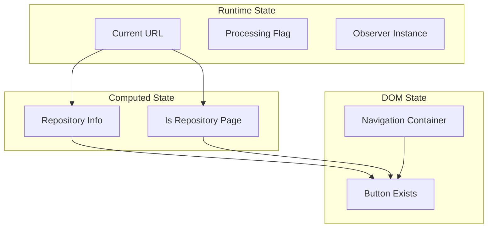

### 6.2 State Variables

```typescript
/**
 * Global state (module-level)
 */
interface ExtensionState {
  // Current URL being processed
  currentUrl: string;

  // Flag to prevent concurrent injections
  isProcessing: boolean;

  // MutationObserver instance
  observer: MutationObserver | null;

  // Debounce timer ID
  debounceTimer: number | null;

  // Last known repository info
  lastRepoInfo: RepoInfo | null;
}
```

**State Transitions:**
- `isProcessing`: `false` → `true` (on navigation) → `false` (after injection)
- `currentUrl`: Updates on every navigation event
- `observer`: `null` → `MutationObserver` (on init) → `null` (on cleanup)

---

## 7. Extension Lifecycle

### 7.1 Lifecycle Stages

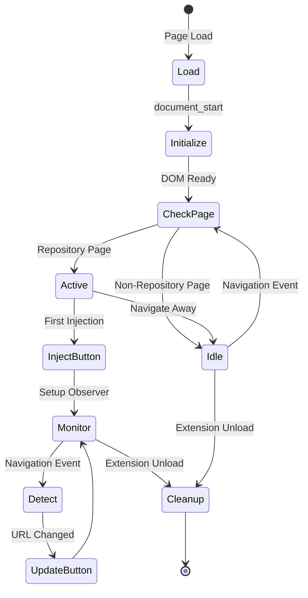

### 7.2 Lifecycle Events

```typescript
/**
 * Extension lifecycle hooks
 */
interface LifecycleHooks {
  // Called when content script loads
  onLoad(): void;

  // Called when DOM is ready
  onDomReady(): void;

  // Called on navigation events
  onNavigation(url: string): void;

  // Called before extension unload
  onCleanup(): void;
}
```

**Event Timing:**
1. **Load** (`document_start`): Content script injected
2. **DOM Ready** (~50-200ms): Initial button injection
3. **Navigation** (SPA): Re-injection on URL change
4. **Cleanup**: Observer disconnection

---

## 8. DOM Integration Strategy

### 8.1 DOM Injection Points

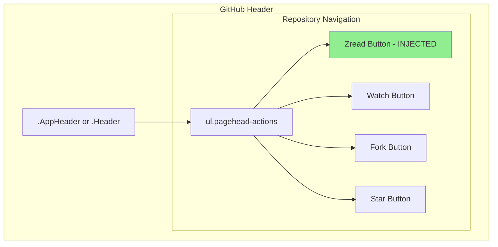

**Target Selector:** `ul.pagehead-actions`

**Injection Strategy:**
```typescript
// Find navigation container
const navActions = document.querySelector('ul.pagehead-actions');

// Create list item container
const listItem = document.createElement('li');
listItem.className = 'zread-container';

// Insert as first child
navActions.prepend(listItem);
```

### 8.2 DOM Observer Strategy

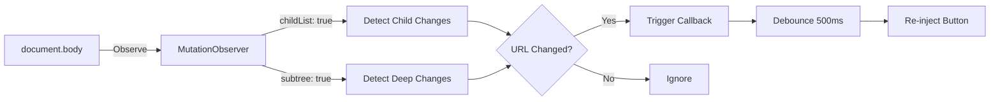

**Observer Configuration:**
```typescript
{
  childList: true,    // Watch for added/removed nodes
  subtree: true,      // Watch entire subtree
  attributes: false   // Ignore attribute changes (performance)
}
```

### 8.3 Fallback Strategies

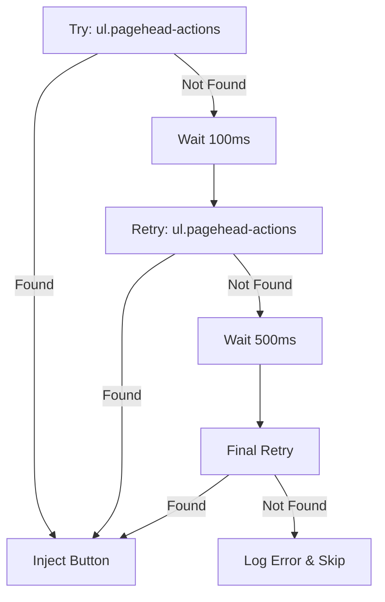

---

## 9. Error Handling Architecture

### 9.1 Error Categories

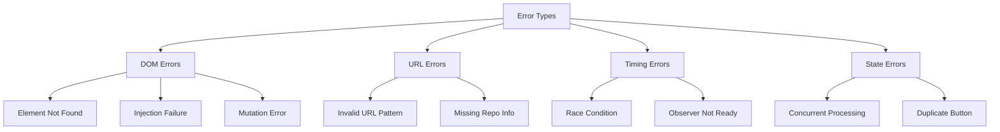

### 9.2 Error Handling Strategy

```typescript
/**
 * Error handling levels
 */
enum ErrorLevel {
  DEBUG = 'debug',     // Development only
  WARN = 'warn',       // Non-critical issues
  ERROR = 'error',     // Critical failures
}

/**
 * Error handler interface
 */
interface ErrorHandler {
  // Log error with context
  logError(level: ErrorLevel, message: string, error?: Error): void;

  // Handle recoverable errors
  handleRecoverable(error: Error, retry: () => void): void;

  // Handle fatal errors
  handleFatal(error: Error): void;
}
```

**Error Responses:**
- **Element Not Found**: Retry with exponential backoff (100ms, 500ms, 1000ms)
- **Invalid URL**: Silent fail (log in dev mode)
- **Injection Failure**: Log error, continue operation
- **Race Condition**: Skip duplicate operation via processing flag

---

## 10. Performance Design

### 10.1 Performance Budget

```mermaid
gantt
    title Extension Performance Timeline
    dateFormat X
    axisFormat %L ms

    section Load
    Content Script Load    :0, 30
    DOM Check             :30, 20

    section Injection
    Find Container        :50, 20
    Create Element        :70, 10
    Insert to DOM         :80, 10

    section Total
    Total Impact          :0, 90

    section Budget
    Budget Limit          :crit, 0, 100
```

**Performance Targets:**
- Content script load: <30ms
- Button injection: <50ms
- Total page impact: <100ms
- Memory footprint: <5MB

### 10.2 Optimization Techniques

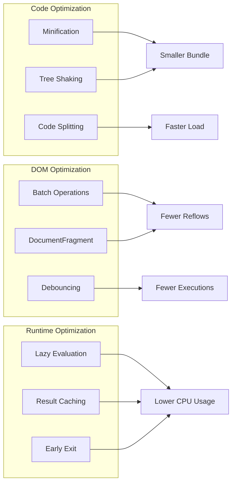

**Key Optimizations:**
1. **Debouncing**: 500ms delay on navigation events
2. **Early Exit**: Check button existence before injection
3. **Selector Caching**: Cache frequently queried elements
4. **Minimal Observer Scope**: Target specific DOM changes only
5. **Lazy Imports**: Load utilities only when needed

### 10.3 Performance Monitoring

```typescript
/**
 * Performance metrics interface
 */
interface PerformanceMetrics {
  // Time to inject button
  injectionTime: number;

  // Observer callback execution time
  observerTime: number;

  // Total memory usage
  memoryUsage: number;

  // Number of injections
  injectionCount: number;
}

/**
 * Performance monitoring (dev mode only)
 */
function measurePerformance(operation: string, fn: () => void): void {
  if (import.meta.env.DEV) {
    const start = performance.now();
    fn();
    const duration = performance.now() - start;
    console.log(`[Zread Perf] ${operation}: ${duration.toFixed(2)}ms`);
  } else {
    fn();
  }
}
```

---

## 11. Browser Compatibility Design

### 11.1 Multi-Browser Support Strategy

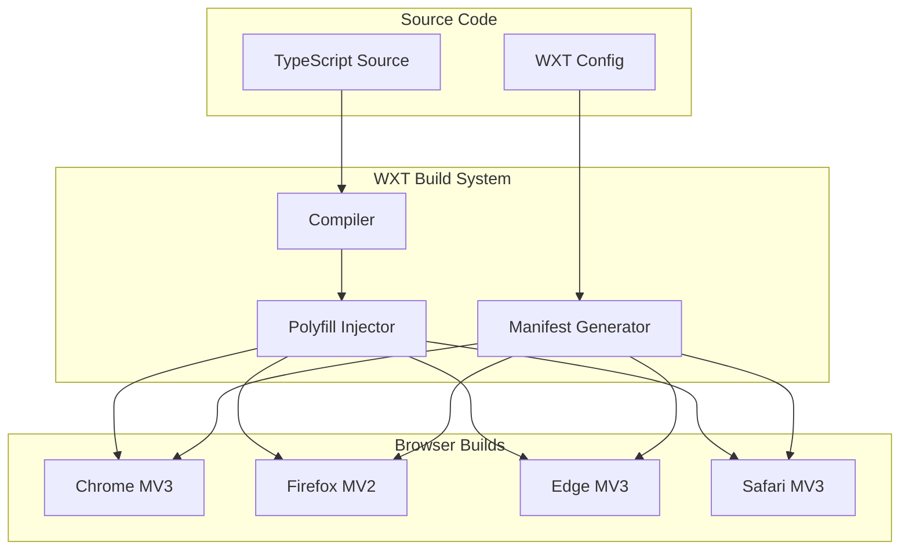

### 11.2 API Abstraction Layer

WXT provides unified browser API access:

```typescript
// WXT browser API abstraction
import { browser } from 'wxt/browser';

// Works across all browsers
const url = browser.runtime.getURL('icon/icon-16.png');
const message = browser.i18n.getMessage('buttonLabel');
```

---

## 12. Security Design

### 12.1 Security Architecture

```mermaid
graph TB
    subgraph "Security Layers"
        CSP[Content Security Policy]
        PERM[Permission Minimization]
        SANDBOX[Sandboxed Execution]
        XSS[XSS Prevention]
    end

    subgraph "Protections"
        NO_INLINE[No Inline Scripts]
        NO_EVAL[No eval()]
        TEXT_CONTENT[textContent Only]
        CREATE_ELEM[createElement Only]
    end

    subgraph "Privacy"
        NO_TRACKING[No Tracking]
        NO_STORAGE[No Data Storage]
        NO_API[No External APIs]
        LOCAL_ONLY[Local Processing]
    end

    CSP --> NO_INLINE
    CSP --> NO_EVAL

    XSS --> TEXT_CONTENT
    XSS --> CREATE_ELEM

    PERM --> NO_TRACKING
    PERM --> NO_STORAGE

    SANDBOX --> LOCAL_ONLY
    SANDBOX --> NO_API
```

### 12.2 Security Principles

1. **Minimal Permissions**: Only `scripting` and `https://github.com/*`
2. **No Data Collection**: Zero external API calls
3. **XSS Prevention**: Use `createElement` and `textContent` only
4. **CSP Compliance**: No inline scripts or eval
5. **Sandboxed Execution**: Content script isolation

---

## 13. Testing Strategy

### 13.1 Test Architecture

```mermaid
graph LR
    subgraph "Test Levels"
        UNIT[Unit Tests]
        INTEGRATION[Integration Tests]
        E2E[E2E Tests]
        MANUAL[Manual Testing]
    end

    subgraph "Test Targets"
        URL_TEST[URL Transformer]
        BTN_TEST[Button Injector]
        NAV_TEST[Navigation Handler]
        FULL_TEST[Full Flow]
    end

    UNIT --> URL_TEST
    UNIT --> BTN_TEST
    UNIT --> NAV_TEST

    INTEGRATION --> BTN_TEST
    INTEGRATION --> NAV_TEST

    E2E --> FULL_TEST
    MANUAL --> FULL_TEST
```

### 13.2 Test Cases

**Unit Tests:**
- URL extraction with various patterns
- Button element creation
- Observer setup and cleanup

**Integration Tests:**
- Button injection with mocked DOM
- Navigation handling with URL changes

**E2E Tests:**
- Full extension lifecycle on real GitHub pages
- Cross-browser compatibility

**Manual Tests:**
- Visual regression testing
- Different GitHub page types
- Browser-specific quirks

---

## Appendix A: Sequence Diagrams

### A.1 Complete Extension Flow

```mermaid
sequenceDiagram
    autonumber
    participant User
    participant Browser
    participant GitHub
    participant Extension
    participant UrlTransformer
    participant ButtonInjector
    participant NavigationHandler
    participant Zread

    User->>Browser: Navigate to github.com/owner/repo
    Browser->>GitHub: Request page
    GitHub-->>Browser: HTML Response

    Browser->>Extension: Inject content script
    Extension->>Extension: Initialize

    Extension->>UrlTransformer: extractRepoInfo(location.href)
    UrlTransformer-->>Extension: { owner, repo }

    Extension->>ButtonInjector: zreadButtonExists()
    ButtonInjector-->>Extension: false

    Extension->>ButtonInjector: injectZreadButton(owner, repo)
    ButtonInjector->>GitHub: Find ul.pagehead-actions
    ButtonInjector->>ButtonInjector: Create button element
    ButtonInjector->>UrlTransformer: generateZreadUrl(owner, repo)
    UrlTransformer-->>ButtonInjector: https://zread.ai/owner/repo
    ButtonInjector->>GitHub: Insert button into DOM
    ButtonInjector-->>Extension: true

    Extension->>NavigationHandler: setupNavigationObserver()
    NavigationHandler-->>Extension: MutationObserver

    Note over Extension: Extension ready

    User->>GitHub: Click different repository
    GitHub->>GitHub: SPA navigation
    GitHub->>NavigationHandler: DOM mutation event
    NavigationHandler->>NavigationHandler: Debounce 500ms
    NavigationHandler->>Extension: Navigation callback

    Extension->>ButtonInjector: removeZreadButton()
    Extension->>UrlTransformer: extractRepoInfo(newUrl)
    Extension->>ButtonInjector: injectZreadButton(owner, repo)

    Note over Extension: Button updated

    User->>ButtonInjector: Click Zread button
    ButtonInjector->>Browser: Open new tab
    Browser->>Zread: Navigate to zread.ai/owner/repo
    Zread-->>Browser: Documentation page
```

---

## Appendix B: Class Diagrams

### B.1 Module Relationships

```mermaid
classDiagram
    class ContentScript {
        -state: ExtensionState
        +main() void
        +injectButtonIfNeeded() void
        +handleNavigation() void
        -cleanup() void
    }

    class UrlTransformer {
        +extractRepoInfo(url: string) RepoInfo|null
        +generateZreadUrl(owner: string, repo: string) string
        +isRepositoryPage(pathname: string) boolean
    }

    class ButtonInjector {
        +injectZreadButton(owner: string, repo: string) boolean
        +zreadButtonExists() boolean
        +removeZreadButton() void
        +createButtonElement(owner: string, repo: string) HTMLElement
    }

    class NavigationHandler {
        -observer: MutationObserver
        -processing: boolean
        +setupNavigationObserver(callback: Function) MutationObserver
        +setupUrlChangeDetection(callback: Function) CleanupFunction
        +cleanupObservers() void
        +isProcessing() boolean
    }

    class GitHubDetector {
        +isRepoPage() boolean
        +findNavigationContainer() HTMLElement|null
        +isPageReady() boolean
        +detectPage() PageDetectionResult
        +waitForNavigation(timeout: number) Promise~HTMLElement~
    }

    ContentScript --> UrlTransformer : uses
    ContentScript --> ButtonInjector : uses
    ContentScript --> NavigationHandler : uses
    ContentScript --> GitHubDetector : uses
    ButtonInjector --> UrlTransformer : uses
    ButtonInjector --> GitHubDetector : uses
```

---

**End of Design Specification**

This design specification provides the architectural foundation for implementing the GitHub Zread Button extension using modern web extension patterns and best practices.
