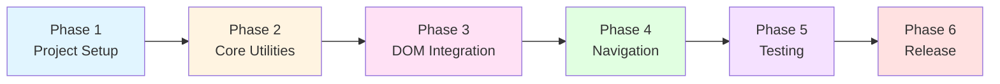

# GitHub Zread Button - Implementation Plan

**Version:** 1.0.0
**Date:** 2025-11-09
**Based on:** Design Specification v1.0.0

---

## Table of Contents

1. [Overview](#1-overview)
2. [Development Phases](#2-development-phases)
3. [Phase 1: Project Setup](#3-phase-1-project-setup)
4. [Phase 2: Core Utilities](#4-phase-2-core-utilities)
5. [Phase 3: DOM Integration](#5-phase-3-dom-integration)
6. [Phase 4: Navigation Handling](#6-phase-4-navigation-handling)
7. [Phase 5: Testing & Quality](#7-phase-5-testing--quality)
8. [Phase 6: Documentation & Release](#8-phase-6-documentation--release)
9. [Implementation Checklist](#9-implementation-checklist)
10. [Risk Mitigation](#10-risk-mitigation)

---

## 1. Overview

### 1.1 Implementation Strategy

This implementation plan follows a **bottom-up, test-driven approach**:
- Build core utilities first (URL handling, detection)
- Layer on DOM manipulation (button injection)
- Add reactivity (navigation handling)
- Comprehensive testing at each phase
- Incremental validation with real GitHub pages

### 1.2 Key Principles

1. **Incremental Development**: Each phase produces working, testable code
2. **Test-First**: Write tests before/alongside implementation
3. **Validation**: Test on real GitHub pages after each phase
4. **Documentation**: Update docs as features are implemented
5. **Quality Gates**: Each phase has acceptance criteria

### 1.3 Timeline Estimate

| Phase | Effort | Dependencies |
|-------|--------|-------------|
| Phase 1: Project Setup | 2-4 hours | None |
| Phase 2: Core Utilities | 4-6 hours | Phase 1 |
| Phase 3: DOM Integration | 4-6 hours | Phase 2 |
| Phase 4: Navigation Handling | 3-5 hours | Phase 3 |
| Phase 5: Testing & Quality | 4-6 hours | Phase 4 |
| Phase 6: Documentation & Release | 2-3 hours | Phase 5 |
| **Total** | **19-30 hours** | |

---

## 2. Development Phases



---

## 3. Phase 1: Project Setup

**Goal:** Establish development environment and project structure

### 3.1 Initialize WXT Project

**Tasks:**
1. Create new directory: `github-zread-button`
2. Initialize WXT project with TypeScript template
   ```bash
   npm init wxt@latest github-zread-button
   # Select: TypeScript, Chrome extension
   ```
3. Install dependencies
   ```bash
   cd github-zread-button
   npm install
   ```

**Files Created:**
- `package.json`
- `wxt.config.ts`
- `tsconfig.json`
- `.gitignore`
- `entrypoints/content.ts` (starter)

### 3.2 Configure WXT

**File:** `wxt.config.ts`

```typescript
import { defineConfig } from 'wxt';

export default defineConfig({
  manifest: {
    name: 'GitHub Zread Button',
    description: 'Adds a Zread.ai button to GitHub repository pages',
    version: '1.0.0',
    permissions: [],
    host_permissions: ['https://github.com/*'],
  },
  modules: ['@wxt-dev/module-react'],
});
```

**Key Configurations:**
- Host permissions: `https://github.com/*`
- Content script match pattern: `https://github.com/*/*`
- Manifest V3 compliance
- Multi-browser support enabled

### 3.3 Setup TypeScript Configuration

**File:** `tsconfig.json`

```json
{
  "compilerOptions": {
    "target": "ES2020",
    "module": "ESNext",
    "lib": ["ES2020", "DOM"],
    "moduleResolution": "bundler",
    "strict": true,
    "esModuleInterop": true,
    "skipLibCheck": true,
    "forceConsistentCasingInFileNames": true,
    "resolveJsonModule": true,
    "isolatedModules": true,
    "noUnusedLocals": true,
    "noUnusedParameters": true,
    "noImplicitReturns": true,
    "noFallthroughCasesInSwitch": true
  },
  "include": ["entrypoints/**/*", "utils/**/*", "*.ts"],
  "exclude": ["node_modules", ".output"]
}
```

### 3.4 Create Directory Structure

```bash
mkdir -p entrypoints
mkdir -p utils
mkdir -p assets/styles
mkdir -p assets/icons
mkdir -p public/icon
mkdir -p tests/unit
mkdir -p tests/integration
```

**Expected Structure:**
```
github-zread-button/
├── entrypoints/
│   └── content.ts
├── utils/
├── assets/
│   ├── styles/
│   └── icons/
├── public/
│   └── icon/
├── tests/
│   ├── unit/
│   └── integration/
├── wxt.config.ts
├── tsconfig.json
└── package.json
```

### 3.5 Setup Testing Framework

**Install Vitest:**
```bash
npm install -D vitest @vitest/ui jsdom
npm install -D @testing-library/dom @testing-library/jest-dom
```

**File:** `vitest.config.ts`

```typescript
import { defineConfig } from 'vitest/config';

export default defineConfig({
  test: {
    environment: 'jsdom',
    globals: true,
    setupFiles: ['./tests/setup.ts'],
  },
});
```

**File:** `tests/setup.ts`

```typescript
import '@testing-library/jest-dom';
```

### 3.6 Create Placeholder Icon

**Task:** Create a simple 128x128 icon
- Use any design tool or placeholder service
- Save as: `public/icon/icon-128.png`
- Generate variants: 16, 32, 48, 128

**Temporary Solution:**
```bash
# Use a placeholder icon generator or create a simple SVG
```

### 3.7 Initialize Git Repository

```bash
git init
git add .
git commit -m "Initial project setup with WXT and TypeScript"
```

### 3.8 Phase 1 Acceptance Criteria

- [ ] WXT project initializes without errors
- [ ] `npm run dev` builds successfully
- [ ] Extension loads in Chrome developer mode
- [ ] TypeScript compiles without errors
- [ ] Testing framework runs (`npm test`)
- [ ] All directories created
- [ ] Git repository initialized

**Validation:**
```bash
npm run dev        # Should build successfully
npm test           # Should run (no tests yet)
```

---

## 4. Phase 2: Core Utilities

**Goal:** Implement URL transformation and GitHub detection logic

### 4.1 Implement URL Transformer

**File:** `utils/url-transformer.ts`

**Tasks:**

1. **Define TypeScript Interfaces**

```typescript
/**
 * Repository information extracted from URL
 */
export interface RepoInfo {
  owner: string;
  repo: string;
}
```

2. **Implement `extractRepoInfo()` Function**

```typescript
/**
 * Extract repository owner and name from GitHub URL
 * @param url - Full URL or pathname
 * @returns Repository info or null if invalid
 */
export function extractRepoInfo(url: string): RepoInfo | null {
  try {
    // Handle both full URLs and pathnames
    const pathname = url.startsWith('http')
      ? new URL(url).pathname
      : url;

    // Pattern: /owner/repo[/...]
    const match = pathname.match(/^\/([^/]+)\/([^/]+)/);

    if (!match) return null;

    const [, owner, repo] = match;

    // Clean repo name (remove .git, tree/*, etc.)
    const cleanRepo = repo.split(/[?#]/)[0];

    return {
      owner: owner.trim(),
      repo: cleanRepo.trim(),
    };
  } catch (error) {
    console.error('[Zread] URL extraction error:', error);
    return null;
  }
}
```

3. **Implement `generateZreadUrl()` Function**

```typescript
/**
 * Generate Zread.ai URL from repository information
 * @param owner - Repository owner
 * @param repo - Repository name
 * @returns Full Zread.ai URL
 */
export function generateZreadUrl(owner: string, repo: string): string {
  return `https://zread.ai/${encodeURIComponent(owner)}/${encodeURIComponent(repo)}`;
}
```

4. **Implement `isRepositoryPage()` Function**

```typescript
/**
 * Check if pathname represents a repository page
 * @param pathname - URL pathname
 * @returns True if repository page
 */
export function isRepositoryPage(pathname: string): boolean {
  // Must have at least /owner/repo
  const segments = pathname.split('/').filter(s => s.length > 0);
  return segments.length >= 2;
}
```

**Unit Tests:** `tests/unit/url-transformer.test.ts`

```typescript
import { describe, it, expect } from 'vitest';
import { extractRepoInfo, generateZreadUrl, isRepositoryPage } from '../../utils/url-transformer';

describe('extractRepoInfo', () => {
  it('should extract owner and repo from valid URL', () => {
    const result = extractRepoInfo('https://github.com/facebook/react');
    expect(result).toEqual({ owner: 'facebook', repo: 'react' });
  });

  it('should extract from pathname', () => {
    const result = extractRepoInfo('/facebook/react');
    expect(result).toEqual({ owner: 'facebook', repo: 'react' });
  });

  it('should extract from nested paths', () => {
    const result = extractRepoInfo('/facebook/react/issues/123');
    expect(result).toEqual({ owner: 'facebook', repo: 'react' });
  });

  it('should return null for invalid URLs', () => {
    expect(extractRepoInfo('/facebook')).toBeNull();
    expect(extractRepoInfo('/')).toBeNull();
    expect(extractRepoInfo('')).toBeNull();
  });

  it('should handle query parameters', () => {
    const result = extractRepoInfo('/facebook/react?tab=readme');
    expect(result).toEqual({ owner: 'facebook', repo: 'react' });
  });
});

describe('generateZreadUrl', () => {
  it('should generate correct Zread URL', () => {
    const url = generateZreadUrl('facebook', 'react');
    expect(url).toBe('https://zread.ai/facebook/react');
  });

  it('should encode special characters', () => {
    const url = generateZreadUrl('user@name', 'repo name');
    expect(url).toContain(encodeURIComponent('user@name'));
    expect(url).toContain(encodeURIComponent('repo name'));
  });
});

describe('isRepositoryPage', () => {
  it('should return true for repository pages', () => {
    expect(isRepositoryPage('/facebook/react')).toBe(true);
    expect(isRepositoryPage('/owner/repo/issues')).toBe(true);
  });

  it('should return false for non-repository pages', () => {
    expect(isRepositoryPage('/')).toBe(false);
    expect(isRepositoryPage('/facebook')).toBe(false);
    expect(isRepositoryPage('/explore')).toBe(false);
  });
});
```

**Validation:**
```bash
npm test -- url-transformer.test.ts
```

### 4.2 Implement GitHub Detector

**File:** `utils/github-detector.ts`

**Tasks:**

1. **Implement `isRepoPage()` Function**

```typescript
import { isRepositoryPage } from './url-transformer';

/**
 * Check if current page is a repository page
 * @returns True if on a GitHub repository page
 */
export function isRepoPage(): boolean {
  return isRepositoryPage(window.location.pathname);
}
```

2. **Implement `findNavigationContainer()` Function**

```typescript
/**
 * Find GitHub navigation container element
 * @returns Navigation element or null if not found
 */
export function findNavigationContainer(): HTMLElement | null {
  // Try primary selector
  const primary = document.querySelector<HTMLElement>('ul.pagehead-actions');
  if (primary) return primary;

  // Fallback selectors for different GitHub UI versions
  const fallbacks = [
    'nav.UnderlineNav ul',
    '.reponav-wrapper ul',
  ];

  for (const selector of fallbacks) {
    const element = document.querySelector<HTMLElement>(selector);
    if (element) return element;
  }

  return null;
}
```

3. **Implement `isPageReady()` Function**

```typescript
/**
 * Check if GitHub page is fully loaded and ready
 * @returns True if page is ready
 */
export function isPageReady(): boolean {
  return (
    document.readyState === 'complete' ||
    document.readyState === 'interactive'
  ) && findNavigationContainer() !== null;
}
```

4. **Implement `detectPage()` Function**

```typescript
import { extractRepoInfo, type RepoInfo } from './url-transformer';

/**
 * Page detection result
 */
export interface PageDetectionResult {
  isRepoPage: boolean;
  repoInfo: RepoInfo | null;
  hasNavigation: boolean;
}

/**
 * Comprehensive page detection
 * @returns Detection result with all relevant info
 */
export function detectPage(): PageDetectionResult {
  const isRepo = isRepoPage();
  const repoInfo = isRepo ? extractRepoInfo(window.location.pathname) : null;
  const hasNavigation = findNavigationContainer() !== null;

  return {
    isRepoPage: isRepo,
    repoInfo,
    hasNavigation,
  };
}
```

5. **Implement `waitForNavigation()` Function**

```typescript
/**
 * Wait for navigation container to be available
 * @param timeout - Maximum wait time in ms (default: 5000)
 * @returns Promise resolving to element or null
 */
export function waitForNavigation(timeout = 5000): Promise<HTMLElement | null> {
  return new Promise((resolve) => {
    // Check immediately
    const existing = findNavigationContainer();
    if (existing) {
      resolve(existing);
      return;
    }

    // Setup observer
    const observer = new MutationObserver(() => {
      const container = findNavigationContainer();
      if (container) {
        observer.disconnect();
        clearTimeout(timer);
        resolve(container);
      }
    });

    observer.observe(document.body, {
      childList: true,
      subtree: true,
    });

    // Timeout fallback
    const timer = setTimeout(() => {
      observer.disconnect();
      resolve(null);
    }, timeout);
  });
}
```

**Unit Tests:** `tests/unit/github-detector.test.ts`

```typescript
import { describe, it, expect, beforeEach, afterEach } from 'vitest';
import { isRepoPage, findNavigationContainer, isPageReady, detectPage } from '../../utils/github-detector';

describe('GitHub Detector', () => {
  beforeEach(() => {
    document.body.innerHTML = '';
  });

  describe('findNavigationContainer', () => {
    it('should find ul.pagehead-actions', () => {
      document.body.innerHTML = '<ul class="pagehead-actions"></ul>';
      const result = findNavigationContainer();
      expect(result).not.toBeNull();
      expect(result?.tagName).toBe('UL');
    });

    it('should return null when not found', () => {
      const result = findNavigationContainer();
      expect(result).toBeNull();
    });
  });

  describe('detectPage', () => {
    it('should detect repository page', () => {
      // Mock location
      Object.defineProperty(window, 'location', {
        value: { pathname: '/facebook/react' },
        writable: true,
      });

      document.body.innerHTML = '<ul class="pagehead-actions"></ul>';

      const result = detectPage();
      expect(result.isRepoPage).toBe(true);
      expect(result.repoInfo).toEqual({ owner: 'facebook', repo: 'react' });
      expect(result.hasNavigation).toBe(true);
    });
  });
});
```

### 4.3 Phase 2 Acceptance Criteria

- [ ] All URL transformer functions implemented
- [ ] All GitHub detector functions implemented
- [ ] Unit tests pass with >90% coverage
- [ ] Functions handle edge cases gracefully
- [ ] TypeScript types are properly defined
- [ ] No runtime errors in tests

**Validation:**
```bash
npm test -- --coverage
```

---

## 5. Phase 3: DOM Integration

**Goal:** Implement button creation and injection logic

### 5.1 Create Button Styles

**File:** `assets/styles/content.css`

```css
/* Zread Button Styles */
.zread-container {
  display: inline-flex;
  align-items: center;
}

.zread-button {
  display: inline-flex;
  align-items: center;
  gap: 4px;
  padding: 5px 16px;
  font-size: 12px;
  font-weight: 500;
  line-height: 20px;
  white-space: nowrap;
  vertical-align: middle;
  cursor: pointer;
  user-select: none;
  border: 1px solid;
  border-radius: 6px;
  text-decoration: none;
  transition: all 0.2s ease;
}

/* Light mode */
.zread-button {
  color: #24292f;
  background-color: #f6f8fa;
  border-color: rgba(27, 31, 36, 0.15);
}

.zread-button:hover {
  background-color: #f3f4f6;
  border-color: rgba(27, 31, 36, 0.15);
}

/* Dark mode */
[data-color-mode="dark"] .zread-button {
  color: #c9d1d9;
  background-color: #21262d;
  border-color: rgba(240, 246, 252, 0.1);
}

[data-color-mode="dark"] .zread-button:hover {
  background-color: #30363d;
  border-color: rgba(240, 246, 252, 0.1);
}

/* Icon */
.zread-button .octicon {
  display: inline-flex;
  align-items: center;
  vertical-align: text-bottom;
}

.zread-button img {
  display: block;
}
```

### 5.2 Implement Button Injector

**File:** `utils/button-injector.ts`

**Tasks:**

1. **Define Constants**

```typescript
const ZREAD_CONTAINER_CLASS = 'zread-container';
const ZREAD_BUTTON_CLASS = 'zread-button';
const ZREAD_BUTTON_SELECTOR = `.${ZREAD_CONTAINER_CLASS}`;
```

2. **Implement `zreadButtonExists()` Function**

```typescript
/**
 * Check if Zread button currently exists in DOM
 * @returns True if button exists
 */
export function zreadButtonExists(): boolean {
  return document.querySelector(ZREAD_BUTTON_SELECTOR) !== null;
}
```

3. **Implement `createButtonElement()` Function**

```typescript
import { generateZreadUrl } from './url-transformer';

/**
 * Create button element without injecting
 * @param owner - Repository owner
 * @param repo - Repository name
 * @returns HTMLElement ready for injection
 */
export function createButtonElement(owner: string, repo: string): HTMLElement {
  const container = document.createElement('li');
  container.className = ZREAD_CONTAINER_CLASS;

  const link = document.createElement('a');
  link.href = generateZreadUrl(owner, repo);
  link.target = '_blank';
  link.rel = 'noopener noreferrer';
  link.className = `btn-sm btn BtnGroup-item ${ZREAD_BUTTON_CLASS}`;

  // Create icon span
  const iconSpan = document.createElement('span');
  iconSpan.className = 'octicon';

  // For now, use a simple text icon (replace with actual icon later)
  const iconText = document.createTextNode('📖');
  iconSpan.appendChild(iconText);

  // Create text node
  const textNode = document.createTextNode('Zread');

  // Assemble
  link.appendChild(iconSpan);
  link.appendChild(textNode);
  container.appendChild(link);

  return container;
}
```

4. **Implement `injectZreadButton()` Function**

```typescript
import { findNavigationContainer } from './github-detector';

/**
 * Inject Zread button into GitHub navigation
 * @param owner - Repository owner
 * @param repo - Repository name
 * @returns True if injection successful
 */
export function injectZreadButton(owner: string, repo: string): boolean {
  try {
    // Check if button already exists
    if (zreadButtonExists()) {
      console.debug('[Zread] Button already exists, skipping injection');
      return false;
    }

    // Find navigation container
    const navContainer = findNavigationContainer();
    if (!navContainer) {
      console.warn('[Zread] Navigation container not found');
      return false;
    }

    // Create button
    const button = createButtonElement(owner, repo);

    // Insert as first child
    navContainer.insertBefore(button, navContainer.firstChild);

    console.debug('[Zread] Button injected successfully');
    return true;
  } catch (error) {
    console.error('[Zread] Button injection failed:', error);
    return false;
  }
}
```

5. **Implement `removeZreadButton()` Function**

```typescript
/**
 * Remove Zread button from DOM
 * Idempotent - safe to call even if button doesn't exist
 */
export function removeZreadButton(): void {
  const button = document.querySelector(ZREAD_BUTTON_SELECTOR);
  if (button) {
    button.remove();
    console.debug('[Zread] Button removed');
  }
}
```

### 5.3 Create Mock Icon Asset

**File:** `public/icon/zread-icon.svg`

```svg
<svg width="16" height="16" viewBox="0 0 16 16" fill="none" xmlns="http://www.w3.org/2000/svg">
  <rect width="16" height="16" rx="3" fill="#4F46E5"/>
  <path d="M4 4h8v2H4V4zm0 3h8v2H4V7zm0 3h5v2H4v-2z" fill="white"/>
</svg>
```

**Update `createButtonElement()` to use real icon:**

```typescript
// Replace iconText with image
const iconImg = document.createElement('img');
iconImg.src = chrome.runtime.getURL('icon/zread-icon.svg');
iconImg.width = 16;
iconImg.height = 16;
iconImg.alt = 'Zread';
iconSpan.appendChild(iconImg);
```

### 5.4 Update Manifest for Assets

**File:** `wxt.config.ts`

```typescript
export default defineConfig({
  manifest: {
    // ... existing config
    web_accessible_resources: [
      {
        resources: ['icon/zread-icon.svg'],
        matches: ['https://github.com/*'],
      },
    ],
  },
});
```

### 5.5 Integration Tests

**File:** `tests/integration/button-injection.test.ts`

```typescript
import { describe, it, expect, beforeEach } from 'vitest';
import { injectZreadButton, zreadButtonExists, removeZreadButton } from '../../utils/button-injector';

describe('Button Injection Integration', () => {
  beforeEach(() => {
    document.body.innerHTML = '<ul class="pagehead-actions"></ul>';
  });

  it('should inject button successfully', () => {
    const result = injectZreadButton('facebook', 'react');
    expect(result).toBe(true);
    expect(zreadButtonExists()).toBe(true);
  });

  it('should not inject duplicate buttons', () => {
    injectZreadButton('facebook', 'react');
    const result = injectZreadButton('facebook', 'react');
    expect(result).toBe(false);

    const buttons = document.querySelectorAll('.zread-container');
    expect(buttons.length).toBe(1);
  });

  it('should remove button successfully', () => {
    injectZreadButton('facebook', 'react');
    expect(zreadButtonExists()).toBe(true);

    removeZreadButton();
    expect(zreadButtonExists()).toBe(false);
  });

  it('should generate correct Zread URL', () => {
    injectZreadButton('facebook', 'react');
    const link = document.querySelector<HTMLAnchorElement>('.zread-button');
    expect(link?.href).toBe('https://zread.ai/facebook/react');
  });
});
```

### 5.6 Phase 3 Acceptance Criteria

- [ ] Button styles created and responsive
- [ ] Button injector functions implemented
- [ ] Button can be injected and removed
- [ ] Duplicate injection prevented
- [ ] Integration tests pass
- [ ] Manual test: Button appears on GitHub repo page
- [ ] Manual test: Button links to correct Zread URL
- [ ] Manual test: Button styling matches GitHub UI

**Manual Validation:**
1. Load extension in Chrome
2. Navigate to https://github.com/facebook/react
3. Verify button appears in navigation
4. Click button and verify Zread page opens
5. Test in both light and dark modes

---

## 6. Phase 4: Navigation Handling

**Goal:** Implement SPA navigation detection and re-injection

### 6.1 Implement Navigation Handler

**File:** `utils/navigation-handler.ts`

**Tasks:**

1. **Define Types and State**

```typescript
/**
 * Navigation callback function type
 */
export type NavigationCallback = (url: string) => void;

/**
 * Cleanup function type
 */
export type CleanupFunction = () => void;

// Module-level state
let currentUrl = window.location.href;
let isProcessing = false;
let debounceTimer: number | null = null;
let mutationObserver: MutationObserver | null = null;

const DEBOUNCE_DELAY = 500; // ms
```

2. **Implement `setupUrlChangeDetection()` Function**

```typescript
/**
 * Setup URL change detection
 * @param callback - Function to call on URL change
 * @returns Cleanup function
 */
export function setupUrlChangeDetection(
  callback: NavigationCallback
): CleanupFunction {
  // Store initial URL
  currentUrl = window.location.href;

  const checkUrlChange = () => {
    const newUrl = window.location.href;

    if (newUrl !== currentUrl) {
      console.debug('[Zread] URL changed:', currentUrl, '->', newUrl);
      currentUrl = newUrl;

      // Debounce callback
      if (debounceTimer !== null) {
        clearTimeout(debounceTimer);
      }

      debounceTimer = window.setTimeout(() => {
        if (!isProcessing) {
          isProcessing = true;
          callback(newUrl);
          isProcessing = false;
        }
      }, DEBOUNCE_DELAY);
    }
  };

  // Check periodically (fallback)
  const intervalId = setInterval(checkUrlChange, 1000);

  return () => {
    clearInterval(intervalId);
    if (debounceTimer !== null) {
      clearTimeout(debounceTimer);
    }
  };
}
```

3. **Implement `setupNavigationObserver()` Function**

```typescript
/**
 * Setup mutation observer for navigation changes
 * @param callback - Function to call on navigation
 * @returns MutationObserver instance
 */
export function setupNavigationObserver(
  callback: NavigationCallback
): MutationObserver {
  // Create observer
  const observer = new MutationObserver(() => {
    // Check if URL changed
    const newUrl = window.location.href;

    if (newUrl !== currentUrl) {
      console.debug('[Zread] Navigation detected:', newUrl);
      currentUrl = newUrl;

      // Debounce callback
      if (debounceTimer !== null) {
        clearTimeout(debounceTimer);
      }

      debounceTimer = window.setTimeout(() => {
        if (!isProcessing) {
          isProcessing = true;
          callback(newUrl);
          isProcessing = false;
        }
      }, DEBOUNCE_DELAY);
    }
  });

  // Start observing
  observer.observe(document.body, {
    childList: true,
    subtree: true,
  });

  mutationObserver = observer;

  return observer;
}
```

4. **Implement `cleanupObservers()` Function**

```typescript
/**
 * Cleanup all observers and event listeners
 */
export function cleanupObservers(): void {
  if (mutationObserver) {
    mutationObserver.disconnect();
    mutationObserver = null;
  }

  if (debounceTimer !== null) {
    clearTimeout(debounceTimer);
    debounceTimer = null;
  }

  isProcessing = false;

  console.debug('[Zread] Observers cleaned up');
}
```

5. **Implement `isProcessingNavigation()` Function**

```typescript
/**
 * Check if currently processing navigation
 * @returns True if processing
 */
export function isProcessingNavigation(): boolean {
  return isProcessing;
}
```

### 6.2 Implement Content Script

**File:** `entrypoints/content.ts`

```typescript
import { defineContentScript } from 'wxt/sandbox';
import { extractRepoInfo } from '../utils/url-transformer';
import { detectPage, waitForNavigation } from '../utils/github-detector';
import {
  injectZreadButton,
  removeZreadButton,
  zreadButtonExists
} from '../utils/button-injector';
import {
  setupNavigationObserver,
  cleanupObservers
} from '../utils/navigation-handler';

export default defineContentScript({
  matches: ['https://github.com/*/*'],

  async main() {
    console.log('[Zread] Content script loaded');

    // Initial injection
    await injectButtonIfNeeded();

    // Setup navigation observer
    setupNavigationObserver(handleNavigation);

    // Cleanup on unload
    window.addEventListener('beforeunload', () => {
      cleanupObservers();
    });
  },
});

/**
 * Inject button if conditions are met
 */
async function injectButtonIfNeeded(): Promise<void> {
  try {
    // Detect page type
    const detection = detectPage();

    if (!detection.isRepoPage || !detection.repoInfo) {
      console.debug('[Zread] Not a repository page, skipping');
      return;
    }

    // Wait for navigation container if needed
    if (!detection.hasNavigation) {
      console.debug('[Zread] Waiting for navigation container...');
      const container = await waitForNavigation(5000);
      if (!container) {
        console.warn('[Zread] Navigation container not found after timeout');
        return;
      }
    }

    // Skip if button already exists
    if (zreadButtonExists()) {
      console.debug('[Zread] Button already exists');
      return;
    }

    // Inject button
    const { owner, repo } = detection.repoInfo;
    const success = injectZreadButton(owner, repo);

    if (success) {
      console.log('[Zread] Button injected for', `${owner}/${repo}`);
    }
  } catch (error) {
    console.error('[Zread] Injection error:', error);
  }
}

/**
 * Handle navigation events
 */
async function handleNavigation(url: string): Promise<void> {
  console.debug('[Zread] Handling navigation to:', url);

  // Remove existing button
  removeZreadButton();

  // Re-inject if needed
  await injectButtonIfNeeded();
}
```

### 6.3 Update Manifest for Content Script

**File:** `wxt.config.ts`

```typescript
export default defineConfig({
  manifest: {
    // ... existing config
    content_scripts: [
      {
        matches: ['https://github.com/*/*'],
        js: ['content.js'],
        css: ['assets/styles/content.css'],
        run_at: 'document_idle',
      },
    ],
  },
});
```

### 6.4 Integration Tests for Navigation

**File:** `tests/integration/navigation.test.ts`

```typescript
import { describe, it, expect, beforeEach, afterEach, vi } from 'vitest';
import { setupNavigationObserver, cleanupObservers } from '../../utils/navigation-handler';

describe('Navigation Handler Integration', () => {
  let callback: ReturnType<typeof vi.fn>;

  beforeEach(() => {
    callback = vi.fn();
    document.body.innerHTML = '<div id="app"></div>';
  });

  afterEach(() => {
    cleanupObservers();
  });

  it('should detect URL changes', async () => {
    setupNavigationObserver(callback);

    // Simulate URL change
    Object.defineProperty(window, 'location', {
      value: { href: 'https://github.com/facebook/react' },
      writable: true,
    });

    // Trigger DOM mutation
    const div = document.createElement('div');
    document.body.appendChild(div);

    // Wait for debounce
    await new Promise(resolve => setTimeout(resolve, 600));

    expect(callback).toHaveBeenCalled();
  });

  it('should debounce rapid changes', async () => {
    setupNavigationObserver(callback);

    // Trigger multiple rapid mutations
    for (let i = 0; i < 5; i++) {
      const div = document.createElement('div');
      document.body.appendChild(div);
    }

    // Wait for debounce
    await new Promise(resolve => setTimeout(resolve, 600));

    // Should only call once due to debouncing
    expect(callback).toHaveBeenCalledTimes(1);
  });
});
```

### 6.5 Phase 4 Acceptance Criteria

- [ ] Navigation handler implemented
- [ ] Content script orchestrates all modules
- [ ] Button re-injected on SPA navigation
- [ ] Debouncing prevents multiple injections
- [ ] Integration tests pass
- [ ] Manual test: Navigate between repos, button updates
- [ ] Manual test: Navigate to non-repo page, button removed
- [ ] Manual test: Navigate back to repo, button re-injected

**Manual Validation:**
1. Navigate to https://github.com/facebook/react
2. Verify button appears
3. Click "Issues" tab
4. Verify button persists
5. Navigate to https://github.com/vuejs/vue
6. Verify button updates to new repo
7. Navigate to https://github.com/explore
8. Verify button is removed

---

## 7. Phase 5: Testing & Quality

**Goal:** Comprehensive testing, debugging, and quality assurance

### 7.1 Expand Unit Test Coverage

**Tasks:**

1. **Add Edge Case Tests**

**File:** `tests/unit/edge-cases.test.ts`

```typescript
describe('Edge Cases', () => {
  it('should handle special characters in repo names', () => {
    const info = extractRepoInfo('/owner/repo-with-dashes');
    expect(info).toEqual({ owner: 'owner', repo: 'repo-with-dashes' });
  });

  it('should handle very long repo names', () => {
    const longName = 'a'.repeat(100);
    const info = extractRepoInfo(`/owner/${longName}`);
    expect(info?.repo).toBe(longName);
  });

  it('should handle URL fragments', () => {
    const info = extractRepoInfo('/owner/repo#readme');
    expect(info).toEqual({ owner: 'owner', repo: 'repo' });
  });
});
```

2. **Add Error Handling Tests**

```typescript
describe('Error Handling', () => {
  it('should gracefully handle malformed URLs', () => {
    expect(() => extractRepoInfo('not-a-url')).not.toThrow();
  });

  it('should handle missing DOM elements', () => {
    expect(() => findNavigationContainer()).not.toThrow();
    expect(findNavigationContainer()).toBeNull();
  });
});
```

### 7.2 Browser Compatibility Testing

**Tasks:**

1. **Build for Multiple Browsers**

```bash
npm run build        # Chrome
npm run build:firefox
npm run build:edge
npm run build:safari
```

2. **Test in Each Browser**

Create test checklist:

**File:** `tests/manual/browser-compatibility.md`

```markdown
# Browser Compatibility Checklist

## Chrome
- [ ] Extension loads without errors
- [ ] Button appears on repository pages
- [ ] Button styling correct (light mode)
- [ ] Button styling correct (dark mode)
- [ ] Navigation detection works
- [ ] Button click opens Zread in new tab

## Firefox
- [ ] Extension loads without errors
- [ ] Button appears on repository pages
- [ ] Button styling correct (light mode)
- [ ] Button styling correct (dark mode)
- [ ] Navigation detection works
- [ ] Button click opens Zread in new tab

## Edge
- [ ] Extension loads without errors
- [ ] Button appears on repository pages
- [ ] Button styling correct (light mode)
- [ ] Button styling correct (dark mode)
- [ ] Navigation detection works
- [ ] Button click opens Zread in new tab

## Safari (if applicable)
- [ ] Extension loads without errors
- [ ] Button appears on repository pages
- [ ] Button styling correct (light mode)
- [ ] Button styling correct (dark mode)
- [ ] Navigation detection works
- [ ] Button click opens Zread in new tab
```

### 7.3 Performance Testing

**File:** `tests/performance/injection-speed.test.ts`

```typescript
import { describe, it, expect } from 'vitest';
import { injectZreadButton } from '../../utils/button-injector';

describe('Performance Tests', () => {
  it('should inject button in <50ms', () => {
    document.body.innerHTML = '<ul class="pagehead-actions"></ul>';

    const start = performance.now();
    injectZreadButton('facebook', 'react');
    const duration = performance.now() - start;

    expect(duration).toBeLessThan(50);
  });

  it('should handle rapid re-injections', async () => {
    document.body.innerHTML = '<ul class="pagehead-actions"></ul>';

    // Inject 100 times
    for (let i = 0; i < 100; i++) {
      removeZreadButton();
      injectZreadButton('owner', 'repo');
    }

    // Should still only have one button
    const buttons = document.querySelectorAll('.zread-container');
    expect(buttons.length).toBe(1);
  });
});
```

### 7.4 End-to-End Testing Scenarios

**File:** `tests/manual/e2e-scenarios.md`

```markdown
# End-to-End Test Scenarios

## Scenario 1: First Visit
1. Clear browser cache and cookies
2. Install extension
3. Navigate to https://github.com/facebook/react
4. **Expected:** Button appears within 1 second
5. **Expected:** Button is styled correctly
6. Click button
7. **Expected:** Zread page opens in new tab

## Scenario 2: SPA Navigation
1. Start at https://github.com/facebook/react
2. Click "Issues" tab
3. **Expected:** Button persists
4. Click a different repository link
5. **Expected:** Button updates to new repo
6. Use browser back button
7. **Expected:** Button reverts to previous repo

## Scenario 3: Non-Repository Pages
1. Navigate to https://github.com
2. **Expected:** No button appears
3. Navigate to https://github.com/explore
4. **Expected:** No button appears
5. Navigate to https://github.com/facebook/react
6. **Expected:** Button appears

## Scenario 4: Rapid Navigation
1. Open multiple GitHub repo tabs quickly
2. **Expected:** Button appears in each tab
3. Switch between tabs rapidly
4. **Expected:** No duplicate buttons
5. **Expected:** Correct button for each repo

## Scenario 5: Theme Switching
1. Navigate to https://github.com/facebook/react
2. Switch to dark mode
3. **Expected:** Button styling updates to dark theme
4. Switch back to light mode
5. **Expected:** Button styling updates to light theme
```

### 7.5 Fix Bugs and Issues

**Process:**
1. Run all tests: `npm test`
2. Fix any failing tests
3. Run manual browser tests
4. Document and fix any found bugs
5. Re-run tests
6. Verify fixes

### 7.6 Code Quality Checks

**Install ESLint and Prettier:**

```bash
npm install -D eslint @typescript-eslint/eslint-plugin @typescript-eslint/parser
npm install -D prettier eslint-config-prettier
```

**File:** `.eslintrc.json`

```json
{
  "parser": "@typescript-eslint/parser",
  "extends": [
    "eslint:recommended",
    "plugin:@typescript-eslint/recommended",
    "prettier"
  ],
  "rules": {
    "no-console": ["warn", { "allow": ["warn", "error", "debug"] }],
    "@typescript-eslint/explicit-function-return-type": "error",
    "@typescript-eslint/no-unused-vars": "error"
  }
}
```

**File:** `.prettierrc`

```json
{
  "semi": true,
  "trailingComma": "es5",
  "singleQuote": true,
  "printWidth": 80,
  "tabWidth": 2
}
```

**Run Quality Checks:**

```bash
npm run lint
npm run format
```

### 7.7 Phase 5 Acceptance Criteria

- [ ] All unit tests pass (>90% coverage)
- [ ] All integration tests pass
- [ ] Performance tests pass (<50ms injection)
- [ ] All E2E scenarios pass
- [ ] Works in Chrome, Firefox, Edge
- [ ] No console errors in production
- [ ] Code linted and formatted
- [ ] No TypeScript errors
- [ ] No accessibility issues

---

## 8. Phase 6: Documentation & Release

**Goal:** Finalize documentation and prepare for release

### 8.1 Update README

**File:** `README.md`

```markdown
# GitHub Zread Button

A browser extension that adds a "Zread" button to GitHub repository pages, providing quick access to Zread.ai documentation.

## Features

- 🚀 **Instant Access**: One-click access to Zread.ai documentation
- 🎨 **Native Integration**: Seamlessly matches GitHub's UI
- ⚡ **Fast & Lightweight**: <100ms page impact
- 🔒 **Privacy First**: No data collection, all processing local
- 🌓 **Theme Support**: Works in light and dark modes
- 🔄 **SPA Compatible**: Works with GitHub's client-side navigation

## Installation

### From Chrome Web Store
1. Visit [Chrome Web Store link]
2. Click "Add to Chrome"
3. Visit any GitHub repository

### Manual Installation (Development)
1. Clone this repository
2. Run `npm install`
3. Run `npm run build`
4. Open Chrome extensions (chrome://extensions)
5. Enable "Developer mode"
6. Click "Load unpacked"
7. Select the `.output/chrome-mv3` directory

## Usage

1. Navigate to any GitHub repository
2. Look for the "Zread" button in the repository navigation
3. Click to open the repository documentation on Zread.ai

## Development

### Prerequisites
- Node.js 18+
- npm or yarn

### Setup
```bash
npm install
npm run dev
```

### Testing
```bash
npm test                 # Run all tests
npm test -- --coverage   # Run with coverage
npm run lint            # Lint code
npm run format          # Format code
```

### Building
```bash
npm run build           # Build for Chrome
npm run build:firefox   # Build for Firefox
npm run build:all       # Build for all browsers
```

## Architecture

See [Design Specification](./specs/design.md) for detailed architecture.

## Contributing

1. Fork the repository
2. Create a feature branch
3. Make your changes
4. Run tests
5. Submit a pull request

## License

MIT License - see LICENSE file for details

## Support

- Report issues: [GitHub Issues]
- Documentation: [Link to docs]
```

### 8.2 Create User Guide

**File:** `docs/user-guide.md`

```markdown
# User Guide

## Getting Started

### Installation
[Installation instructions]

### First Use
[First-time setup instructions]

## Features

### Quick Access Button
[Feature explanation]

### Supported Pages
- Repository home pages
- Issues pages
- Pull requests pages
- Code browser
- Commits history
- Any repository subpage

## Troubleshooting

### Button Not Appearing
1. Verify extension is enabled
2. Refresh the page
3. Check browser console for errors

### Button Not Clicking
1. Check popup blocker settings
2. Verify network connection
3. Try different browser

### Report Issues
[Link to issue tracker]
```

### 8.3 Create Change Log

**File:** `CHANGELOG.md`

```markdown
# Changelog

All notable changes to this project will be documented in this file.

## [1.0.0] - 2025-11-09

### Added
- Initial release
- Zread button injection on GitHub repository pages
- Support for GitHub SPA navigation
- Light and dark theme support
- Multi-browser support (Chrome, Firefox, Edge)

### Features
- URL transformation and repository detection
- DOM injection with GitHub UI integration
- Navigation observer for dynamic updates
- Debounced re-injection on page changes
- Privacy-focused, no data collection
```

### 8.4 Create LICENSE

**File:** `LICENSE`

```
MIT License

Copyright (c) 2025 [Your Name]

Permission is hereby granted, free of charge, to any person obtaining a copy
of this software and associated documentation files (the "Software"), to deal
in the Software without restriction, including without limitation the rights
to use, copy, modify, merge, publish, distribute, sublicense, and/or sell
copies of the Software, and to permit persons to whom the Software is
furnished to do so, subject to the following conditions:

[Standard MIT License text]
```

### 8.5 Prepare Extension Store Assets

**Tasks:**

1. **Create Screenshots**
   - Screenshot 1: Button on repository page (light mode)
   - Screenshot 2: Button on repository page (dark mode)
   - Screenshot 3: Zread page opened
   - Dimensions: 1280x800 or 640x400

2. **Create Promotional Images**
   - Small tile: 440x280
   - Large tile: 920x680
   - Marquee: 1400x560

3. **Write Store Description**

```markdown
## Short Description (132 chars)
Quick access to Zread.ai documentation from any GitHub repository page.

## Full Description
GitHub Zread Button adds a convenient "Zread" button to GitHub repository navigation, providing instant access to comprehensive documentation on Zread.ai.

✨ Features:
• One-click access to Zread.ai docs
• Seamless GitHub UI integration
• Fast and lightweight
• Privacy-focused (no tracking)
• Light & dark theme support
• Works with GitHub's navigation

🔒 Privacy:
This extension does not collect any data. All processing happens locally in your browser.

📖 How to Use:
1. Install the extension
2. Visit any GitHub repository
3. Click the "Zread" button in the navigation bar
4. View comprehensive documentation on Zread.ai

Perfect for developers who want quick access to high-quality documentation while browsing GitHub repositories.
```

### 8.6 Final Pre-Release Checklist

**File:** `docs/release-checklist.md`

```markdown
# Release Checklist

## Code Quality
- [ ] All tests passing
- [ ] No TypeScript errors
- [ ] No console errors in production build
- [ ] Code linted and formatted
- [ ] No commented-out code
- [ ] No TODO comments

## Documentation
- [ ] README complete and accurate
- [ ] User guide written
- [ ] Changelog updated
- [ ] License file present
- [ ] Code comments clear

## Testing
- [ ] Unit tests >90% coverage
- [ ] Integration tests pass
- [ ] E2E scenarios pass
- [ ] Tested in Chrome
- [ ] Tested in Firefox
- [ ] Tested in Edge
- [ ] Performance benchmarks met

## Assets
- [ ] Icons created (16, 32, 48, 128)
- [ ] Screenshots captured
- [ ] Promotional images created
- [ ] Store description written

## Build
- [ ] Production build successful
- [ ] Bundle size optimized
- [ ] No development code in production
- [ ] Source maps excluded from production

## Security
- [ ] No hardcoded secrets
- [ ] No XSS vulnerabilities
- [ ] CSP compliant
- [ ] Permissions minimal
- [ ] Dependencies audited

## Legal
- [ ] License file present
- [ ] Copyright notices correct
- [ ] Third-party licenses acknowledged
```

### 8.7 Build Production Release

```bash
# Build for all browsers
npm run build:all

# Verify builds
ls -la .output/

# Create distribution packages
cd .output/chrome-mv3 && zip -r ../chrome-extension.zip . && cd ../..
cd .output/firefox-mv2 && zip -r ../firefox-extension.zip . && cd ../..
```

### 8.8 Phase 6 Acceptance Criteria

- [ ] README complete
- [ ] User guide written
- [ ] Changelog updated
- [ ] License added
- [ ] Store assets created
- [ ] Production build successful
- [ ] Release checklist complete
- [ ] Distribution packages created

---

## 9. Implementation Checklist

### Overall Project Checklist

#### Phase 1: Project Setup ✓
- [ ] WXT project initialized
- [ ] TypeScript configured
- [ ] Directory structure created
- [ ] Testing framework setup
- [ ] Git repository initialized

#### Phase 2: Core Utilities ✓
- [ ] URL transformer implemented
- [ ] GitHub detector implemented
- [ ] Unit tests written
- [ ] All tests passing

#### Phase 3: DOM Integration ✓
- [ ] Button styles created
- [ ] Button injector implemented
- [ ] Icon assets created
- [ ] Integration tests passing
- [ ] Manual validation complete

#### Phase 4: Navigation Handling ✓
- [ ] Navigation handler implemented
- [ ] Content script orchestration complete
- [ ] SPA navigation working
- [ ] Integration tests passing
- [ ] Manual validation complete

#### Phase 5: Testing & Quality ✓
- [ ] Unit test coverage >90%
- [ ] Integration tests passing
- [ ] E2E scenarios passing
- [ ] Browser compatibility verified
- [ ] Performance benchmarks met
- [ ] Code quality checks passing

#### Phase 6: Documentation & Release ✓
- [ ] README complete
- [ ] User guide written
- [ ] Changelog updated
- [ ] Store assets created
- [ ] Production build successful
- [ ] Release checklist complete

---

## 10. Risk Mitigation

### 10.1 Identified Risks

| Risk | Impact | Probability | Mitigation |
|------|--------|-------------|------------|
| GitHub UI changes breaking selectors | High | Medium | Use multiple fallback selectors, implement resilient detection |
| Extension performance impact | Medium | Low | Implement debouncing, minimize DOM operations, profile performance |
| Browser compatibility issues | Medium | Medium | Test in all browsers, use WXT abstraction layer |
| Button styling conflicts | Low | Medium | Use unique class names, scope CSS carefully |
| Navigation detection failures | High | Low | Implement multiple detection methods, add fallbacks |
| Race conditions on fast navigation | Medium | Medium | Use processing flags, implement proper debouncing |

### 10.2 Mitigation Strategies

**GitHub UI Changes:**
- Use multiple selector fallbacks
- Implement comprehensive detection
- Monitor GitHub for UI updates
- Version extension with UI compatibility notes

**Performance:**
- Profile during development
- Set strict performance budgets
- Implement lazy loading where possible
- Minimize observer scope

**Browser Compatibility:**
- Leverage WXT's multi-browser support
- Test in all target browsers
- Use polyfills when needed
- Document browser-specific issues

**Styling Conflicts:**
- Use unique, namespaced class names
- Scope all CSS rules
- Test with various GitHub themes
- Use CSS specificity carefully

**Navigation Detection:**
- Combine MutationObserver + URL polling
- Implement retry logic
- Add comprehensive logging (dev mode)
- Handle edge cases gracefully

**Race Conditions:**
- Use `isProcessing` flag
- Implement proper debouncing
- Test rapid navigation scenarios
- Add concurrency safeguards

---

## Appendix A: Development Commands

```bash
# Development
npm run dev              # Start dev server with hot reload
npm run dev:firefox      # Dev server for Firefox
npm run dev:edge         # Dev server for Edge

# Building
npm run build            # Build for Chrome
npm run build:firefox    # Build for Firefox
npm run build:edge       # Build for Edge
npm run build:all        # Build for all browsers

# Testing
npm test                 # Run all tests
npm test -- --watch      # Run tests in watch mode
npm test -- --coverage   # Run tests with coverage
npm run test:unit        # Run unit tests only
npm run test:integration # Run integration tests only

# Code Quality
npm run lint             # Lint code
npm run lint:fix         # Fix linting errors
npm run format           # Format code with Prettier
npm run type-check       # Check TypeScript types

# Utilities
npm run clean            # Clean build artifacts
npm run zip              # Create distribution packages
```

---

## Appendix B: File Structure Reference

```
github-zread-button/
├── .output/                    # Build output (gitignored)
│   ├── chrome-mv3/
│   ├── firefox-mv2/
│   └── edge-mv3/
├── assets/
│   ├── icons/
│   │   └── zread-icon.svg
│   └── styles/
│       └── content.css
├── docs/
│   ├── user-guide.md
│   └── release-checklist.md
├── entrypoints/
│   └── content.ts              # Main content script
├── public/
│   └── icon/
│       ├── icon-16.png
│       ├── icon-32.png
│       ├── icon-48.png
│       └── icon-128.png
├── specs/
│   ├── design.md
│   └── implementation-plan.md
├── tests/
│   ├── unit/
│   │   ├── url-transformer.test.ts
│   │   ├── github-detector.test.ts
│   │   └── edge-cases.test.ts
│   ├── integration/
│   │   ├── button-injection.test.ts
│   │   └── navigation.test.ts
│   ├── performance/
│   │   └── injection-speed.test.ts
│   ├── manual/
│   │   ├── browser-compatibility.md
│   │   └── e2e-scenarios.md
│   └── setup.ts
├── utils/
│   ├── url-transformer.ts      # URL parsing & transformation
│   ├── github-detector.ts      # Page detection logic
│   ├── button-injector.ts      # Button creation & injection
│   └── navigation-handler.ts   # SPA navigation handling
├── .eslintrc.json
├── .gitignore
├── .prettierrc
├── CHANGELOG.md
├── LICENSE
├── package.json
├── README.md
├── tsconfig.json
├── vitest.config.ts
└── wxt.config.ts
```

---

## Appendix C: Testing Strategy Summary

### Unit Tests
- **Target:** Individual functions
- **Tools:** Vitest, jsdom
- **Coverage:** >90%
- **Files:**
  - `url-transformer.test.ts`
  - `github-detector.test.ts`
  - `button-injector.test.ts`
  - `navigation-handler.test.ts`

### Integration Tests
- **Target:** Module interactions
- **Tools:** Vitest, Testing Library
- **Coverage:** Critical paths
- **Files:**
  - `button-injection.test.ts`
  - `navigation.test.ts`

### Performance Tests
- **Target:** Speed benchmarks
- **Tools:** Vitest, performance API
- **Thresholds:**
  - Button injection: <50ms
  - Total page impact: <100ms

### E2E Tests
- **Target:** User workflows
- **Tools:** Manual testing
- **Scenarios:** See `tests/manual/e2e-scenarios.md`

### Browser Compatibility Tests
- **Target:** Cross-browser functionality
- **Browsers:** Chrome, Firefox, Edge, Safari
- **Checklist:** See `tests/manual/browser-compatibility.md`

---

**End of Implementation Plan**

This implementation plan provides a complete roadmap for building the GitHub Zread Button extension, from initial setup through final release.
